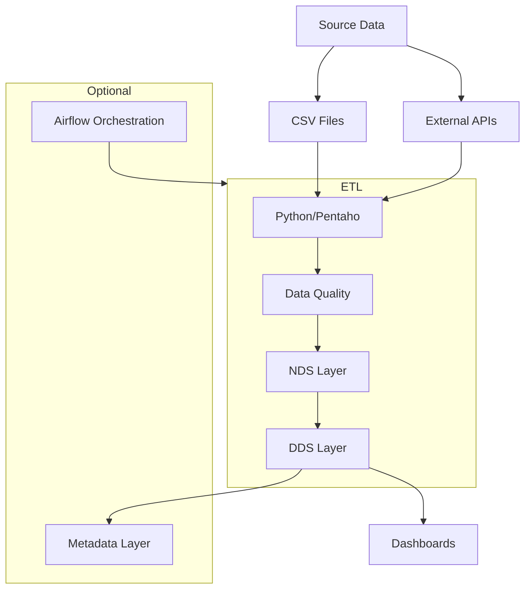

# Data Engineer Diploma Project

**Objective:** Create ETL process documentation based on the provided dataset

## Project Phases
1. Data processing and analysis
2. Design normalized data schema (NDS) 
3. Define fact and dimension tables (DDS)
4. Develop ETL processes for:
   - Loading data into NDS
   - Creating data marts
5. Define metrics and create dashboards
6. Document results and conclusions

## Requirements

### ETL Development
Create and document data loading processes for:
- NDS (normalized storage)
- DDS (star schema)
- Data Quality layer (optional enhancement)

### Dashboard Creation
Build Tableau dashboards based on DDS

## Technical Implementation Options

### ETL Processing
- Python (pandas) + SQL

### Data Sources
- Provided CSV dataset
- External API integration (optional enhancement)

### Additional Components
- Airflow orchestration (optional)
- Metadata layer with loading statistics dashboards (optional)

## Deliverables
1. Interactive dashboards
2. Data warehouse schema documentation
3. ETL process documentation

